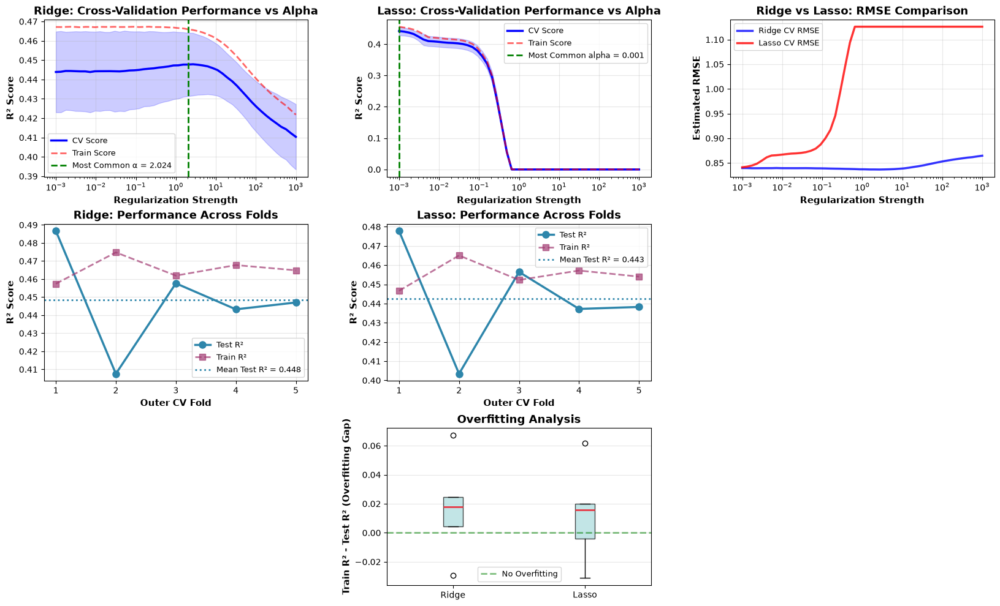

# NYC Property Sale Price Prediction

Predicting New York City property sale prices from the NYC Department of Finance rolling sales data
(84,548 sales from September 2016 to August 2017). The pipeline cleans the raw records, explores them,
engineers features and compares **Ridge** and **Lasso** regression using nested cross-validation,
with neighborhoods target-encoded inside each fold.

## Results

Nested cross-validation (5 outer folds × 4 inner folds, 50 alphas from 10⁻³ to 10³), predicting
`log1p(SALE PRICE)`:

| Model | Mean test R² | Std test R² | Mean train R² | Overfit gap | Mean RMSE | Mean MAE | Most common α |
|-------|-------------:|------------:|--------------:|------------:|----------:|---------:|--------------:|
| Ridge | 0.448 | 0.028 | 0.465 | 0.017 | 0.836 | 0.410 | 2.024 |
| Lasso | 0.443 | 0.027 | 0.455 | 0.012 | 0.840 | 0.411 | 0.001 |

Ridge does slightly better than Lasso on every metric, and the small gap between train and test R²
shows neither model is overfitting.



## Pipeline

| Stage | Module | What it does |
|-------|--------|--------------|
| Cleaning | `nyc_sales/cleaning.py` | Fixes dtypes, splits the sale date, and drops duplicates, $0 sales, sales of $10 or less, missing tax classes, and zero or missing ZIP code, year built and square footage (84,548 → 28,516 rows) |
| EDA | `nyc_sales/eda.py` | Skew and category summaries; histograms, correlation heatmap, pairplot, category counts and sale price box plots |
| Features | `nyc_sales/features.py` | Adds age of property, tax/building class changed flags and sale season; drops identifier-like columns; one-hot encodes; log-scales price, area and unit counts |
| Modeling | `nyc_sales/modeling.py` | Scales continuous features and target-encodes `NEIGHBORHOOD`, then tunes Ridge and Lasso in nested CV and compares them |
| Orchestration | `nyc_sales/pipeline.py` | Runs the stages in order and saves the figures and results |

## Getting started

Requires Python 3.10 or newer (tested with 3.12).

```bash
python -m venv .venv
source .venv/bin/activate        # Windows: .venv\Scripts\activate
pip install -r requirements.txt
```

Download `nyc-rolling-sales.csv` from the
[NYC Property Sales dataset on Kaggle](https://www.kaggle.com/datasets/new-york-city/nyc-property-sales)
and save it as `data/raw/nyc-rolling-sales.csv`. From a terminal:

```bash
curl -L -o nyc-property-sales.zip https://www.kaggle.com/api/v1/datasets/download/new-york-city/nyc-property-sales
unzip nyc-property-sales.zip -d data/raw
```

## Usage

Run from the repository root:

```bash
python -m nyc_sales              # full run: cleaning, EDA printouts and figures, modeling
python -m nyc_sales --skip-eda   # cleaning, features and modeling only
python -m nyc_sales --show       # also open the figures in windows
python -m nyc_sales --data path/to/nyc-rolling-sales.csv --reports-dir path/to/output
```

Each run writes:

- `reports/figures/`: the six EDA figures (`01`–`06`) and the model comparison (`07_model_comparison.png`)
- `reports/results/`: per-fold nested CV results (`ridge_nested_cv.csv`, `lasso_nested_cv.csv`) and
  `model_comparison.csv`

The stages can also be used from Python:

```python
from nyc_sales.cleaning import load_raw_data, clean_data
from nyc_sales.features import engineer_features
from nyc_sales.modeling import run_modeling

nyc_df = clean_data(load_raw_data())
results, comparison_df, fig = run_modeling(engineer_features(nyc_df))
```

## Project structure

```
├── data/raw/                       # nyc-rolling-sales.csv goes here (not committed)
├── notebooks/
│   └── nyc_sales_analysis.ipynb    # original exploratory analysis, with commentary
├── nyc_sales/
│   ├── config.py                   # paths and hyperparameters
│   ├── cleaning.py                 # loading and cleaning
│   ├── eda.py                      # distribution and correlation analysis
│   ├── features.py                 # feature engineering
│   ├── modeling.py                 # Ridge vs. Lasso nested cross-validation
│   └── pipeline.py                 # command-line entry point
├── reports/
│   ├── figures/
│   └── results/
└── requirements.txt
```

## Notes

- All metrics are on the log scale: RMSE and MAE are printed with a `$` but are in units of
  `log1p(SALE PRICE)`, not dollars.
- The target encoder shuffles its internal folds without a fixed seed, so results vary slightly between
  runs. For example, Ridge's most common alpha can flip between the neighboring grid values 2.02 and 2.68.
- pandas is pinned below 3.0 because the cleaning step relies on how pandas 2.x replaces values in
  categorical columns.
- The notebook was written in Google Colab (its first cell mounts Google Drive). The `nyc_sales` package
  is the runnable version of the same analysis.
